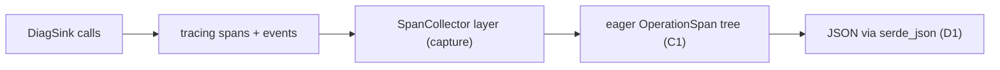
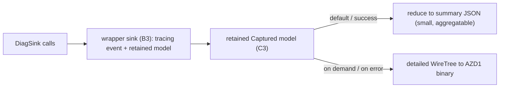
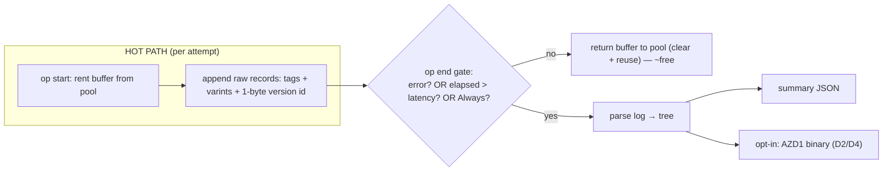

# Next-Gen Rust SDK Diagnostics — POC Report

> Single, self-contained write-up of the diagnostics design spikes built from the Nalu × Ashley
> design call. Every number and sample below is produced by committed code on this branch
> (`nalutripician/rust-diagnostics-prototype`). Spike crates live under `sdk/core/azure_core_diag_*`
> and are all `publish = false`.

---

## Reader's guide: the three designs in plain language

> **New to this? Read this section first.** The rest of the report compares three ways the Rust SDK
> could capture and emit diagnostics for one *operation* (an SDK call, including its retries and any
> fan-out). Each design has a descriptive name used throughout; the short crate ids in parentheses
> (`combo1`/`combo2`/`combo3`) are how they appear in the source tree and the benchmark CSV.

| Design | Crate id | What it produces | One-line pitch |
|---|---|---|---|
| **Eager JSON Baseline** | `combo3` | A nested JSON object, built on every call | Most familiar and the best OpenTelemetry fit, but the most expensive and the largest output. It's the yardstick the others are measured against. |
| **Binary Span Tree** | `combo1` | A small **binary blob** (decode to JSON with a tool) | Captures the complete call tree cheaply, throws it away for free when the call succeeds, and is the smallest full-fidelity format. |
| **Tiered Hybrid** | `combo2` | A tiny human-readable **summary** by default; the full binary tree on error or when asked | Looks like today's request diagnostics, costs almost nothing on the happy path, and never loses detail when something breaks. |
| **Deferred Gated Capture** ⭐ | `combo4` | Nothing on a fast success; a summary (and opt-in binary) only when an op is slow or errors | The team-preferred synthesis: append-only capture, then *decide at the end* whether the diagnostics are even worth building. Cheapest happy path by far. **Recommended.** |

**A few terms that recur:**

- **Operation** — one SDK call end to end, including its retry attempts and any fan-out.
- **Attempt** — a single HTTP try within an operation (a `429` then a `200` = two attempts).
- **Fan-out** — a query that splits into many parallel sub-requests, one per partition / "feed range".
- **Happy path** — the call succeeded; diagnostics are rarely read, so the cost paid here matters most.
- **Scenarios S1–S4** — fixed test cases run against every design so the numbers compare
  apples-to-apples: **S1** a single success, **S2** a retry-then-success, **S3** an error, **S4** a
  fan-out with 10 or 25 children.

If you only remember one thing: **the Deferred Gated Capture appends a compact log on the hot path,
then at the end of the operation decides whether to build diagnostics at all — on a fast success it
throws the log away for ~free; on a slow op or an error it builds the same small summary (and
optional binary detail) the Tiered Hybrid and Binary Span Tree produce.**

---

## How to demo this live

```powershell
# Re-run the full benchmark + regenerate every sample (writes DIAGNOSTICS-BENCH.csv + target/diag-samples/**)
cargo run --release -p azure_core_diag_runner --bin diag-bench

# Decode a real binary diagnostics blob with the actual tool (D4)
cargo build -p azure_core_diag_combo1 --bin diag-decode
./target/debug/diag-decode ./target/diag-samples/combo1/S2.bin

# Run the whole prototype test suite
cargo test -p azure_core_diag_common -p azure_core_diag_combo1 -p azure_core_diag_combo2 -p azure_core_diag_combo3 -p azure_core_diag_combo4 --all-features
```

---

## 1. TL;DR & recommendation

**Adopt the Deferred Gated Capture (the team-preferred synthesis); it reuses the proven pieces of
the Binary Span Tree and Tiered Hybrid.** All three share one binary wire format (`AZD1`), so this is
one contract, not competing designs:

- **Deferred Gated Capture** ⭐ is the recommended **lead design**. On the hot path it only appends a
  compact log to a pooled buffer (~tens of ns); at `op_end` a policy decides — fast success → drop
  the log for **~free** (no build, no output); slow op or error → build the same aggregatable summary
  (and, opt-in, the binary detail). On a fast success it costs **~80 ns** total — **~11× cheaper than
  the next-best design and ~140× cheaper than the eager baseline** — and it carries full SDK/driver
  version + User-Agent provenance in a single byte (rehydrated only when built).
- **Tiered Hybrid** and **Binary Span Tree** are the proven components it builds on: the
  aggregatable summary schema, and the compact `AZD1` binary + `diag-decode` tool, respectively.
  Either is a fine standalone step if the full gated design is staged in.
- **Eager JSON Baseline** (tracing-native) stays as the baseline and the natural **OpenTelemetry
  export** path, not the default — it pays full eager cost on every call (**~11.4 µs** on the happy
  path) and emits the largest JSON.

**Headline numbers (median, release, Windows x86_64):**

| Metric | Eager JSON Baseline | Binary Span Tree | Tiered Hybrid (summary) | Deferred Gated (dropped) |
|---|--:|--:|--:|--:|
| Happy-path cost, S1 success | 11,390 ns | 2,552 ns | 904 ns | **80 ns** |
| Output size, S4×25 fan-out | 3,464 B | 832 B | 304 B | 0 B (dropped) / 386 B (built summary) |

**Two decisions for the scrum to settle:**

1. **Adopt the gated design + default policy** — build on error or over a latency threshold,
   summary by default with binary opt-in? And does per-operation auto-build-on-error fit Cosmos's
   existing `DiagnosticsThresholds`?
2. **Wire-format & attribute-key ownership** — ratify the `AZD1` format + version policy, the
   service-request-id / RU attribute keys, the version/User-Agent preamble encoding, and who owns the
   shared `diag-decode` tool (see §8 and `DIAGNOSTICS-CROSS-SDK.md`).

---

## 2. Problem & goals

From the design call, today's request-focused diagnostics fall short on:

- **Fan-out capture** — query/routing operations spawn many parallel sub-requests (per partition /
  feed range) that the request-centric model can't represent as a tree.
- **Transport events** — there's appetite for per-attempt transport detail (start / headers /
  complete / failed), bounded by what `reqwest` can expose.
- **OTel reconstruction** — diagnostics should map cleanly onto OpenTelemetry spans.
- **Granularity** — one verbosity doesn't fit all; cheap-by-default with full detail on demand.
- **Binary + tool** — a compact wire format plus a decode tool/skill, rather than always-verbose JSON.
- **Outcome-aware cost** — pay for full diagnostics only when they're useful (errors / explicitly
  requested), and ~nothing on the happy path.

**Goal of this POC:** build comparable prototypes of the candidate designs, benchmark them on
identical scenarios, show what the diagnostics actually look like, and recommend a direction.

### Reference scenarios (identical across every design)

| Scenario | Shape |
|---|---|
| **S1** | single success: `200`, `svc-200`, RU 4.2 |
| **S2** | retry then success: `429`→`200`, 2 attempts, `svc-429`/`svc-200`, RU 4.2 |
| **S3** | error: `404`, `svc-404`, captured on the **error path** |
| **S4** | fan-out: parent + N children (N=10, 25), each with plan-node id + feed range |

The service request id is always captured from the **response** `x-ms-request-id` header, on both
success and error paths (proven by the `*_via_mock` tests that route through a `MockHttpClient`).

---

## 3. The four axes & the three designs

A full design is one pick per axis; the designs stack picks across axes.

- **Axis 1 — capture model:** A1 request-focused (today) · A2 span hierarchy · A3 hybrid.
- **Axis 2 — capture mechanism:** B1 bespoke · B2 `tracing`-native · B3 wrapper types.
- **Axis 3 — storage:** C1 eager objects · C2 arena (Vec + index ids) · C3 outcome-aware.
- **Axis 4 — output:** D1 JSON · D2 binary blob · D3 tiered verbosity · D4 decode tool + skill.

| Design (crate id) | Stack | Role |
|---|---|---|
| **Eager JSON Baseline** (`combo3`) | A2 + B2 + C1 + D1 | Baseline / strawman; OTel-export path |
| **Binary Span Tree** (`combo1`) | A2/A3 + C2 + D2 + D4 | Component: full-fidelity, cheap, small |
| **Tiered Hybrid** (`combo2`) | A3 + B3 + C3 + D3 | Component: customer- & migration-friendly summary |
| **Deferred Gated Capture** (`combo4`) | A3 + append-only C2 + C3 gate + D2/D3/D4 | **Recommended lead**: cheapest capture + build-only-when-wanted |

All three consume the same `DiagSink` event trait, driven by a deterministic scenario driver:

```rust
pub trait DiagSink {
    fn op_start(&mut self, input: &OperationInput, start_ns: u64);
    fn attempt(&mut self, attempt_index: u32, status: u16,
               service_request_id: Option<&str>, request_charge: Option<f64>,
               start_ns: u64, duration_ns: u64);
    fn child(&mut self, child_index: u32, plan_node_id: &str, feed_range: &str,
             start_ns: u64, duration_ns: u64);
    fn op_end(&mut self, outcome: Outcome, attempt_count: u32, total_ns: u64);
}
```

---

## 4. The prototypes

### Eager JSON Baseline — tracing-native (A2 · B2 · C1 · D1)



An outer `operation` span wraps the retries; each attempt is an `attempt` span; fan-out makes
`routing` children. A capturing `tracing-subscriber` layer materializes the whole tree into typed
objects, serialized to JSON.

- **Good:** least code; idiomatic; strongest OTel alignment (it *is* spans/events); any existing
  `tracing` exporter works alongside.
- **Bad:** no drop trick — full eager cost on every call; largest JSON; needs the capture layer to
  get a programmatic object out.

### Binary Span Tree — Span + Encoded binary (A2/A3 · C2 · D2 · D4)


The span tree is a flat arena (`Vec<Node>`, `u32` parent indices). On success it's dropped without
serializing; on error/verbose it's encoded to the compact `AZD1` binary. Key signatures:

```rust
pub fn capture_blob(input: &OperationInput, clock: &MockClock, verbose: bool) -> Option<Vec<u8>>;
// common wire codec, shared with the Tiered Hybrid's detailed tier:
pub fn encode(tree: &WireTree, compress: bool) -> Vec<u8>;
pub fn decode(blob: &[u8]) -> Result<WireTree, DecodeError>;
```

- **Good:** cheapest happy path (push + free drop); smallest full-fidelity wire size; clean
  versioned format; arena→JSON pain sidestepped (binary is itself a flat node list).
- **Bad:** opaque bytes — needs the decode tool/skill to read; DEFLATE has a CPU cost on large blobs
  (tunable threshold; off the hot path anyway).

### Tiered Hybrid (A3 · B3 · C3 · D3)



A wrapper sink dual-writes to `tracing` and a retained model. Two tiers: a default **summary**
(request-style, aggregatable) and an on-demand/on-error **detailed** binary (reuses the Binary Span
Tree's format). `effective_verbosity` auto-escalates errors to detailed so error diagnostics are
never lossy:

```rust
pub enum Verbosity { Summary, Detailed }
pub fn effective_verbosity(requested: Verbosity, succeeded: bool) -> Verbosity;
pub fn render(input: &OperationInput, clock: &MockClock,
              requested: Verbosity, thresholds: &SummaryThresholds) -> Rendered;
```

- **Good:** cheapest, smallest default; summary ≈ today's request diagnostics (low-friction
  migration); summary size is independent of fan-out width; full detail exactly when it matters.
- **Bad:** two code paths to maintain; the reducer's "what's in the summary" rules need governance
  (seeded from `DIAGNOSTICS-SIGNALS.md`).

### Deferred Gated Capture ⭐ — the recommended synthesis (A3 · append-only · C3 gate · D2/D3/D4)



The team-preferred design, distilled from the discussion. Each operation rents a `Vec<u8>` from a
`LogPool` and **appends** a compact TLV record stream — attribute keys are implicit in the record
layout (no key bytes), numbers are varints, and the SDK/driver version + User-Agent is a **single
byte** referencing a process-global preamble. At `op_end` a policy decides whether the diagnostics
are worth building; if not, the buffer goes back to the pool for ~free. Building (parse → summary,
opt-in → binary) happens only past the gate.

```rust
pub enum Mode { Off, Threshold, Always }
pub struct DiagnosticsPolicy {
    pub mode: Mode,
    pub latency_threshold_ns: Option<u64>,  // build if the op was slow
    pub capture_on_error: bool,             // build if it errored
    pub binary: bool,                       // opt-in AZD1 detail
}
pub fn collect(pool: &mut LogPool, input: &OperationInput, clock: &MockClock) -> CaptureLog; // hot path: appends only
pub fn should_build(log: &CaptureLog, policy: &DiagnosticsPolicy) -> bool;                    // the gate
pub fn capture_and_gate(pool, input, clock, policy) -> Rendered;  // Dropped | Summary | Detailed
```

- **Good:** cheapest happy path of all designs by a wide margin (append + pooled drop, builds
  nothing); latency *and* error gating (matches Cosmos `DiagnosticsThresholds`); compact version/UA
  provenance for one byte; reuses the summary + `AZD1` binary + `diag-decode` tool unchanged.
- **Bad:** RU stored as `f32` for compactness (rounded on output — size/precision knob); real-pipeline
  async needs the recorder threaded as `&mut`/in `Context` (no hot-path `Mutex`); symbol-table
  sharing vs self-contained blobs is an open call.

---

## 5. Benchmarks

Hand-rolled harness (warmup + 20,000 iterations per phase, median reported). `criterion 0.8` is
available in the workspace; we use the custom harness because it emits one comparison table across
designs/scenarios/phases. Phase costs are cumulative deltas (`construct` = collect+construct −
collect, etc.). Environment: **Windows x86_64, release build.** Full data: `DIAGNOSTICS-BENCH.csv`.

> Rows use the crate ids: `combo3` = **Eager JSON Baseline**, `combo1` = **Binary Span Tree**,
> `combo2` = **Tiered Hybrid** (matching `DIAGNOSTICS-BENCH.csv`).

> Rows use the crate ids: `combo3` = **Eager JSON Baseline**, `combo1` = **Binary Span Tree**,
> `combo2` = **Tiered Hybrid**, `combo4` = **Deferred Gated Capture** (matching `DIAGNOSTICS-BENCH.csv`).

| Combo | Scenario | Mode | collect ns | construct ns | serialize ns | decode ns | discard ns | bytes |
|---|---|---|--:|--:|--:|--:|--:|--:|
| combo3 | S1 | json | 9920 | 700 | 769 | 0 | 0 | 442 |
| combo1 | S1 | binary | 1682 | 1120 | 1348 | 1474 | 870 | 303 |
| combo2 | S1 | summary | 257 | 240 | 407 | 0 | 206 | 248 |
| combo2 | S1 | detailed | 257 | 1584 | 1294 | 1727 | 0 | 303 |
| combo4 | S1 | dropped | 18 | 0 | 0 | 0 | 61 | 0 |
| combo4 | S1 | summary | 18 | 1660 | 625 | 0 | 0 | 375 |
| combo4 | S1 | detailed | 18 | 4074 | 0 | 2136 | 0 | 433 |
| combo3 | S2 | json | 13736 | 1704 | 0 | 0 | 0 | 661 |
| combo1 | S2 | binary | 2383 | 1826 | 1558 | 2287 | 935 | 432 |
| combo2 | S2 | summary | 334 | 910 | 379 | 0 | 113 | 339 |
| combo2 | S2 | detailed | 334 | 2296 | 1692 | 2244 | 0 | 432 |
| combo4 | S2 | dropped | 64 | 0 | 0 | 0 | 44 | 0 |
| combo4 | S2 | summary | 64 | 1858 | 750 | 0 | 0 | 466 |
| combo4 | S2 | detailed | 64 | 33020 | 0 | 10724 | 0 | 368 |
| combo3 | S3 | json | 9780 | 1176 | 812 | 0 | 0 | 471 |
| combo1 | S3 | binary | 1782 | 1379 | 1462 | 1876 | 456 | 331 |
| combo2 | S3 | summary | 277 | 584 | 860 | 0 | 161 | 330 |
| combo2 | S3 | detailed | 277 | 1700 | 1277 | 1610 | 0 | 331 |
| combo4 | S3 | dropped | 32 | 0 | 0 | 0 | 43 | 0 |
| combo4 | S3 | summary | 32 | 1694 | 752 | 0 | 0 | 456 |
| combo4 | S3 | detailed | 32 | 4207 | 0 | 1978 | 0 | 461 |
| combo3 | S4x10 | json | 20170 | 3566 | 2079 | 0 | 0 | 1649 |
| combo1 | S4x10 | binary | 4708 | 4566 | 35048 | 14874 | 1427 | 522 |
| combo2 | S4x10 | summary | 2770 | 0 | 338 | 0 | 447 | 304 |
| combo2 | S4x10 | detailed | 2770 | 3834 | 33782 | 15124 | 0 | 522 |
| combo4 | S4x10 | dropped | 306 | 0 | 0 | 0 | 43 | 0 |
| combo4 | S4x10 | summary | 306 | 3274 | 664 | 0 | 0 | 386 |
| combo4 | S4x10 | detailed | 306 | 42948 | 0 | 15862 | 0 | 599 |
| combo3 | S4x25 | json | 36258 | 7744 | 3276 | 0 | 0 | 3464 |
| combo1 | S4x25 | binary | 8868 | 9466 | 46648 | 22991 | 2942 | 832 |
| combo2 | S4x25 | summary | 3762 | 352 | 479 | 0 | 980 | 304 |
| combo2 | S4x25 | detailed | 3762 | 8734 | 44262 | 23027 | 0 | 832 |
| combo4 | S4x25 | dropped | 711 | 0 | 0 | 0 | 43 | 0 |
| combo4 | S4x25 | summary | 711 | 5668 | 626 | 0 | 0 | 386 |
| combo4 | S4x25 | detailed | 711 | 61430 | 0 | 23983 | 0 | 920 |

### Output size & reduction vs the Eager JSON Baseline

| Scenario | Eager JSON (B) | Binary Tree | Tiered summary | Tiered detailed | Binary × smaller | Tiered-summary × smaller |
|---|--:|--:|--:|--:|--:|--:|
| S1 | 442 | 303 | 248 | 303 | 1.5× | 1.8× |
| S2 | 661 | 432 | 339 | 432 | 1.5× | 1.9× |
| S3 | 471 | 331 | 330 | 331 | 1.4× | 1.4× |
| S4x10 | 1649 | 522 | 304 | 522 | 3.2× | 5.4× |
| S4x25 | 3464 | 832 | 304 | 832 | **4.2×** | **11.4×** |

### Happy-path overhead (S1, success) — the cost paid on the vast majority of calls

| Design | Happy-path cost (ns, median) | Notes |
|---|--:|---|
| Eager JSON Baseline | 11,390 | collect+construct+serialize, **always** |
| Binary Span Tree (drop on success) | 2,552 | collect + free drop (870 ns); **no serialize** |
| Tiered Hybrid (summary default) | 904 | collect + reduce + summary JSON |
| **Deferred Gated Capture (dropped)** | **80** | append (18) + return to pool (61); **builds nothing** |

### Deferred Gated Capture — the gate in action (policy: build on error OR > 5 ms)

Hot-path `collect` (append) is paid always; everything else only when the gate says build.

| Scenario | Gate decision | collect ns | if dropped: +discard ns | if built: +construct+serialize ns | summary bytes | detailed bytes |
|---|---|--:|--:|--:|--:|--:|
| S1 | drop (free) | 18 | 61 | 2286 | 375 | 433 |
| S2 | **build** | 64 | 44 | 2609 | 466 | 368 |
| S3 | **build** | 32 | 43 | 2446 | 456 | 461 |
| S4x10 | **build** | 306 | 43 | 3937 | 386 | 599 |
| S4x25 | **build** | 711 | 43 | 6294 | 386 | 920 |

**Reading the numbers.**
- **Gated capture wins the happy path decisively.** On a fast success the Deferred Gated Capture
  pays ~80 ns and emits nothing — ~11× cheaper than the Tiered Hybrid's summary, ~140× cheaper than
  the eager baseline. The gate drops S1 and builds the (slow) S2/S4 and the errored S3.
- **Size grows with fan-out for JSON, not for the summary.** The Eager JSON Baseline balloons to
  3,464 B at S4×25; the Tiered Hybrid and the gated summary stay flat (~304–386 B) by collapsing the
  25 children to a `child_count` → up to 11.4× smaller.
- **DEFLATE is the cost on big blobs.** The binary `construct/serialize` for wide fan-out (S4) is
  tens of µs once the payload crosses the 512 B auto-compress threshold. That cost is **off the hot
  path** (only when the gate builds *and* binary is opted in); the threshold is the single knob.
- **Decode is out-of-band** (~1.5–24 µs) and never paid during the request.
- **`collect` deltas are noisy** for the cheap combos (they're computed as a difference of two timed
  runs); the robust gated-capture number is the **dropped total** (~80 ns at S1) and the clear
  per-record growth at S4 (more children → bigger append).

---

## 6. Sample gallery

All samples regenerated by `cargo run --release -p azure_core_diag_runner --bin diag-bench` into
`target/diag-samples/<combo>/`. Decoded-from-binary samples below are produced by the **real**
`diag-decode` tool.

### S2 (retry → success) — Eager JSON Baseline (`combo3/S2.json`)

```json
{
  "operation": "read_item",
  "endpoint": "https://contoso.documents.azure.com/dbs/db/colls/c/docs/1",
  "client_request_id": "client-0002",
  "outcome": "success",
  "attempt_count": 2,
  "start_ns": 1700000000000000000,
  "duration_ns": 7000000,
  "attempts": [
    { "attempt_index": 0, "status": 429, "service_request_id": "svc-429",
      "request_charge": 4.2, "start_ns": 1700000000000000000, "duration_ns": 3000000,
      "events": [ { "az.error_kind": "throttled", "az.event": "error", "az.status_code": 429 } ] },
    { "attempt_index": 1, "status": 200, "service_request_id": "svc-200",
      "request_charge": 4.2, "start_ns": 1700000000003000000, "duration_ns": 4000000,
      "events": [ { "az.event": "response", "az.status_code": 200 } ] }
  ],
  "children": []
}
```

### S2 — Binary Span Tree (`combo1/S2.bin`), 432 bytes

Base64 preview (note the `AZD1\x01\x00` header — `QVpEMQEA` — flag `0x00` = uncompressed):

```text
QVpEMQEACXJlYWRfaXRlbQMAAICAqLHjn+fLF8CfqwMABQxhei5vcGVyYXRpb24JcmVhZF9pdGVtC2F6
LmVuZHBvaW50OWh0dHBzOi8vY29udG9zby5kb2N1bWVudHMuYXp1cmUuY29tL2Ricy9kYi9jb2xscy9j
L2RvY3MvMRRhei5jbGllbnRfcmVxdWVzdF9pZAtjbGllbnQtMDAwMhBhei5hdHRlbXB0X2NvdW50ATIK
YXoub3V0Y29tZQdzdWNjZXNz... (432 bytes total)
```

Decoded with the real tool — `./target/debug/diag-decode ./target/diag-samples/combo1/S2.bin`:

```json
{
  "operation": "read_item",
  "nodes": [
    { "parent": null, "kind": 0, "start_ns": 1700000000000000000, "duration_ns": 7000000,
      "status": 0, "attrs": [ ["az.operation","read_item"],
        ["az.endpoint","https://contoso.documents.azure.com/dbs/db/colls/c/docs/1"],
        ["az.client_request_id","client-0002"], ["az.attempt_count","2"], ["az.outcome","success"] ] },
    { "parent": 0, "kind": 1, "start_ns": 1700000000000000000, "duration_ns": 3000000,
      "status": 429, "attrs": [ ["attempt_index","0"], ["az.status_code","429"],
        ["az.service_request_id","svc-429"], ["az.request_charge","4.2"], ["az.error_kind","throttled"] ] },
    { "parent": 0, "kind": 1, "start_ns": 1700000000003000000, "duration_ns": 4000000,
      "status": 200, "attrs": [ ["attempt_index","1"], ["az.status_code","200"],
        ["az.service_request_id","svc-200"], ["az.request_charge","4.2"] ] }
  ]
}
```

### S2 — Tiered Hybrid summary (default tier) (`combo2/S2.summary.json`)

```json
{
  "operation": "read_item", "outcome": "success", "succeeded": true,
  "attempt_count": 2, "retry_count": 1, "total_elapsed_ns": 7000000,
  "total_request_charge": 8.4, "throttle_count": 1,
  "status_counts": { "200": 1, "429": 1 },
  "final_service_request_id": "svc-200", "child_count": 0,
  "top_error": { "status": 429, "error_kind": "throttled", "service_request_id": "svc-429" }
}
```

### S4×25 (fan-out, verbose) — Tiered Hybrid summary stays tiny (`combo2/S4x25.summary.json`, 304 B)

```json
{
  "operation": "query_items", "outcome": "success", "succeeded": true,
  "attempt_count": 1, "retry_count": 0, "total_elapsed_ns": 46000000,
  "total_request_charge": 18.6, "throttle_count": 0,
  "status_counts": { "200": 1 }, "final_service_request_id": "svc-query-200",
  "child_count": 25, "slow_attempt_ns": 6000000, "high_charge": 18.6
}
```

The 25 fan-out children (plan node + feed range each) live in the **detailed** blob
(`combo2/S4x25.detailed.bin`, 832 B) — decode it with `diag-decode` to see all 25 `routing` nodes.
The summary keeps only the aggregate (`child_count`, `slow_attempt_ns`, `high_charge`), which is why
it stays at 304 B regardless of N. The same fan-out in the Eager JSON Baseline is 3,464 B.

### S2 — Deferred Gated Capture summary (`combo4/S2.summary.json`)

Same aggregatable summary as the Tiered Hybrid, plus a compact `client` block whose version/User-Agent
provenance cost a **single byte** on the hot path (rehydrated only here, on build). On a *fast*
success (S1) this operation would instead be **dropped** — nothing built, ~80 ns total.

```json
{
  "operation": "read_item", "outcome": "success",
  "attempt_count": 2, "retry_count": 1, "total_elapsed_ns": 7000000,
  "total_request_charge": 8.4, "throttle_count": 1,
  "status_counts": { "200": 1, "429": 1 },
  "final_service_request_id": "svc-200", "child_count": 0,
  "top_error": { "status": 429, "error_kind": "throttled", "service_request_id": "svc-429" },
  "client": {
    "sdk_version": "azure_data_cosmos 0.1.0",
    "driver_version": "0.1.0",
    "user_agent": "azsdk-rust-azure_data_cosmos/0.1.0 (windows; x86_64)"
  }
}
```

Its detailed binary (`combo4/S2.detailed.bin`) is the same `AZD1` format and decodes with the same
`diag-decode` tool — the version/UA lands on the root node (`az.sdk_version`, `az.user_agent`).

**Regen commands:** every file under `target/diag-samples/**` is rewritten by the bench runner; the
decoded views are produced by `diag-decode <blob>`.

### The four designs vs .NET — how the same operation looks

To make the shapes concrete, here is the **same S2 operation** (`429` → `200`, two attempts) as each
Rust design renders it, next to how .NET's Cosmos SDK renders diagnostics today. The Rust
samples are the **real outputs shown above**; the .NET block below is **illustrative and abridged** —
it reproduces the *shape* of .NET V3 `CosmosDiagnostics.ToString()` (a deeply nested
handler → transport → `StoreResult` tree with a roll-up `Summary` at the top), not exact bytes.

**.NET today — `CosmosDiagnostics` (illustrative, abridged):**

```json
{
  "Summary": { "GatewayCalls": { "(429, 0)": 1, "(200, 0)": 1 } },
  "name": "ReadItemAsync",
  "duration in milliseconds": 7.0,
  "data": { "Client Configuration": "... ~30 fields elided ..." },
  "children": [
    { "name": "ItemSerialize", "duration in milliseconds": 0.1 },
    {
      "name": "Microsoft.Azure.Cosmos.Handlers.RequestInvokerHandler",
      "children": [
        {
          "name": "Microsoft.Azure.Documents.ServerStoreModel Transport Request",
          "duration in milliseconds": 3.0,
          "data": { "Client Side Request Stats": { "StoreResponseStatistics": [
            { "StoreResult": {
                "ActivityId": "svc-429", "StatusCode": "TooManyRequests",
                "SubStatusCode": "3200", "RequestCharge": "4.2" } } ] } }
        },
        {
          "name": "Microsoft.Azure.Documents.ServerStoreModel Transport Request",
          "duration in milliseconds": 4.0,
          "data": { "Client Side Request Stats": { "StoreResponseStatistics": [
            { "StoreResult": {
                "ActivityId": "svc-200", "StatusCode": "OK",
                "SubStatusCode": "0", "RequestCharge": "4.2" } } ] } }
        }
      ]
    }
  ]
}
```

**Reader experience, side by side (same S2 operation):**

| Design | What you scroll through | Aggregatable summary? | Where the service id / status / RU live | Size |
|---|---|---|---|--:|
| **.NET `CosmosDiagnostics`** | Deep handler → transport tree; the `StoreResult` you usually want is several levels down | **Yes** — a `Summary` histogram block at the top | Inside each nested `StoreResult` | Large (often KBs) |
| **Eager JSON Baseline** | Flat-ish JSON: one object per attempt, plus per-attempt events | No (you aggregate yourself) | Top level of each `attempts[]` entry | 661 B |
| **Binary Span Tree** (decoded) | Flat node list linked by `parent` index | No (it *is* the full tree) | `attrs` on each attempt node | 432 B blob |
| **Tiered Hybrid** (default summary) | A single flat record | **Yes** — the whole default output *is* the summary | Top-level fields | 339 B |
| **Deferred Gated Capture** (default) | Usually **nothing** (dropped); on slow/error, one flat summary record | **Yes** — same summary, built only when wanted | Top-level fields | 0 B (dropped) / 466 B (built) |

**Field mapping (.NET `CosmosDiagnostics` → the Rust designs):**

| .NET field | Eager JSON Baseline | Binary Span Tree (decoded node) | Tiered Hybrid / Deferred Gated summary |
|---|---|---|---|
| `Summary` calls histogram | derive from `attempts[]` | derive from nodes | `status_counts` (always present) |
| `StoreResult.ActivityId` | `attempts[].service_request_id` | attr `az.service_request_id` | `final_service_request_id` / `top_error.service_request_id` |
| `StoreResult.StatusCode` | `attempts[].status` | node `status` | `status_counts` keys / `top_error.status` |
| `StoreResult.SubStatusCode` | not modeled (see `DIAGNOSTICS-SIGNALS.md`) | extensible attr | extensible (`top_error`) |
| `StoreResult.RequestCharge` | `attempts[].request_charge` | attr `az.request_charge` | `total_request_charge` / `high_charge` |
| `duration in milliseconds` | `duration_ns` | node `duration_ns` | `total_elapsed_ns` / `slow_attempt_ns` |
| `children` (transport tree) | `attempts[]` + `children[]` | parent-linked nodes | `child_count` (full detail in the binary tier) |
| retries (implicit in tree) | `attempt_count` | attr `az.attempt_count` | `retry_count` / `attempt_count` |
| Client Configuration / User-Agent | (not modeled) | (not modeled) | `client` block (Deferred Gated; 1 byte on the hot path) |

**Takeaways:**

- .NET's **`Summary` block is conceptually the summary the Tiered Hybrid and Deferred Gated Capture
  emit** — a flat, aggregatable roll-up. That is exactly why this is the migration-friendly path and
  .NET is the natural second adopter: a .NET reader already thinks in "summary + drill-down".
- .NET's **full nested tree is conceptually the Binary Span Tree's decoded blob** — the same
  information, but shipped as a compact binary you only materialize on error or on demand, instead of
  building the whole tree every time.
- .NET's **Client Configuration / User-Agent** (recorded once per diagnostics object, not per
  request) is exactly what the Deferred Gated Capture's interned version/UA preamble mirrors —
  one byte on the hot path, rehydrated only on build.
- Net: today's .NET experience is "always build the big tree, with a summary on top." The recommended
  Rust direction (**Deferred Gated Capture**, reusing the Tiered Hybrid summary + Binary Span Tree
  binary) keeps the **summary as the cheap default**, makes the **big tree an opt-in, compact,
  on-error artifact**, and — crucially — **builds nothing at all** on a fast success.

---

## 7. Scorecard (1 = poor, 5 = excellent)

> Reminder of the designs (full descriptions in the Reader's guide): **Eager JSON Baseline** =
> "everything, always, as JSON"; **Binary Span Tree** = "full detail, compact, only when needed";
> **Tiered Hybrid** = "cheap summary by default, full detail on demand"; **Deferred Gated Capture**
> = "append cheaply, then decide at the end whether to build at all".

| Criterion | Eager JSON Baseline | Binary Span Tree | Tiered Hybrid | Deferred Gated Capture |
|---|:--:|:--:|:--:|:--:|
| Happy-path overhead | 2 | 4 | 4 | **5** |
| "Used" (error/verbose) overhead | 3 | 4 | 4 | 4 |
| Build ergonomics | **5** | 4 | 3 | 3 |
| OTel alignment | **5** | 3 | 4 | 4 |
| Cross-SDK portability | 4 | 4 | 4 | 4 |
| Error-path coverage | 4 | **5** | **5** | **5** |
| Size / truncation control | 2 | 4 | **5** | **5** |
| Breaking-change impact | **5** | 3 | 4 | 4 |
| Testability | 4 | **5** | **5** | **5** |
| **Notes** | OTel/baseline | full-fidelity component | summary component | **recommended lead** |

---

## 8. Cross-SDK feasibility (summary)

The **data contract is portable; the mechanism is local.** What travels: span schema, attribute
names, the `AZD1` wire format + version header, the summary schema, and the single shared
`diag-decode` tool/skill. What's Rust-local: the arena storage and the `tracing` mechanism — every
target language has an idiomatic equivalent (growable array + int ids; `Activity`/OTel). The only
non-trivial port is byte-identical `AZD1` encoding (drive it with golden test vectors).

**.NET V3 is the nearest analog and natural second adopter:** its existing request-focused
`CosmosDiagnostics` (plus Fabian's dedup/aggregation work) maps directly onto the summary, and
`Activity`/`ActivitySource` gives an Eager JSON Baseline equivalent for free. Its
once-per-diagnostics Client Configuration / User-Agent is the model for the Deferred Gated Capture's
interned version/UA preamble. Roll out opt-in (keep current diagnostics, add the new format behind a
policy/verbosity flag, stabilize, then flip the default per SDK).

Full table + ratification list: `DIAGNOSTICS-CROSS-SDK.md`.

---

## 9. Recommended combinations

- **Adopt:** the **Deferred Gated Capture** as the lead design. On the hot path it only appends a
  compact log; at `op_end` a policy (latency threshold + error, or always/off) decides whether to
  build — fast successes are dropped for ~free, slow/errored ops build the same aggregatable summary
  (and opt-in binary). It directly answers every goal from the design call: compact append-only
  capture, collection off the hot path, configurable latency+error gate, opt-in binary compaction,
  and compact driver/SDK version + User-Agent provenance.
- **Reuse:** its building blocks are already proven here — the **Tiered Hybrid** summary schema and
  the **Binary Span Tree** `AZD1` binary + `diag-decode` tool. Either is a valid incremental step if
  the gated design is staged in.
- **Keep:** the **Eager JSON Baseline** as the OpenTelemetry export path and the baseline for future
  comparisons.
- **Avoid as default:** the Eager JSON Baseline (eager, always-on cost; biggest payloads) and any
  single-tier design that forces one verbosity on everyone.

---

## 10. Open questions for the scrum

1. **Adopt the gated design + default policy** — summary by default, binary opt-in, build on error or
   over a latency threshold? Does the gate live in core or in Cosmos reusing `DiagnosticsThresholds`?
2. **Async capture threading** — thread the per-operation recorder as `&mut` through the operation
   future, or park it in `Context`, to avoid a hot-path `Mutex`?
3. **Binary format ownership** — who owns `AZD1` + `diag-decode`, the version-evolution policy, and
   the version/User-Agent preamble encoding?
4. **Attribute-key ratification** — `az.service_request_id` vs the core SDK's `az.service_request.id`;
   the RU key; node-kind set. (See `DIAGNOSTICS-SIGNALS.md`.)
5. **Symbol-table sharing** — client-global interning (smallest) vs self-contained per-blob (standalone
   decode, cross-SDK-portable)? And RU as `f32` (compact) vs `f64` (exact)?
6. **Transport detail depth** — given `reqwest` can't split DNS/TLS/connect, is `TransportStart /
   ResponseHeadersReceived / TransportComplete / TransportFailed` the right granularity?

---

## 11. Appendix — reproduce everything

| Artifact | Path |
|---|---|
| Shared scaffolding | `sdk/core/azure_core_diag_common/` |
| Eager JSON Baseline | `sdk/core/azure_core_diag_combo3/` (`FINDINGS.md`) |
| Binary Span Tree | `sdk/core/azure_core_diag_combo1/` (`FINDINGS.md`, `SKILL.md`, `diag-decode` bin) |
| Tiered Hybrid | `sdk/core/azure_core_diag_combo2/` (`FINDINGS.md`) |
| Deferred Gated Capture | `sdk/core/azure_core_diag_combo4/` (`FINDINGS.md`) |
| Bench/sample runner | `sdk/core/azure_core_diag_runner/` (`diag-bench` bin) |
| Bench data | `DIAGNOSTICS-BENCH.csv` |
| Signal analysis | `DIAGNOSTICS-SIGNALS.md` |
| Cross-SDK | `DIAGNOSTICS-CROSS-SDK.md` |
| Samples | `target/diag-samples/**` (regenerated by the runner) |

```powershell
# Verification gate (all spike crates): build, test, clippy, fmt
foreach ($c in 'azure_core_diag_common','azure_core_diag_combo1','azure_core_diag_combo2','azure_core_diag_combo3','azure_core_diag_combo4','azure_core_diag_runner') {
  cargo build -p $c
  cargo test  -p $c --all-features
  cargo clippy -p $c --all-features -- -D warnings
  cargo fmt -p $c --check
}

# Regenerate numbers + samples
cargo run --release -p azure_core_diag_runner --bin diag-bench
```

Branch: `nalutripician/rust-diagnostics-prototype`. Each design is its own crate/commit on this
branch; `git log --oneline` shows the per-checkpoint history.
