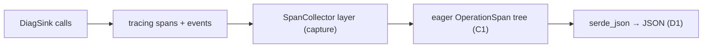
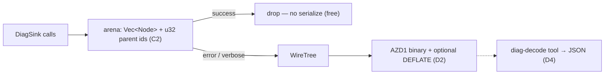
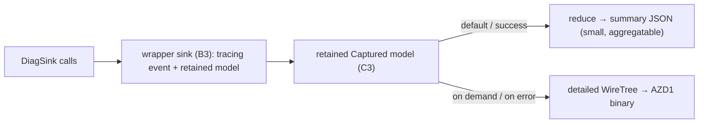

# Next-Gen Rust SDK Diagnostics — POC Report

> Single, self-contained write-up of the diagnostics design spikes built from the Nalu × Ashley
> design call. Every number and sample below is produced by committed code on this branch
> (`nalutripician/rust-diagnostics-prototype`). Spike crates live under `sdk/core/azure_core_diag_*`
> and are all `publish = false`.

---

## Reader's guide: the three designs in plain language

> **New to this? Read this section first.** The rest of the report compares three ways the Rust SDK
> could capture and emit diagnostics for one *operation* (an SDK call, including its retries and any
> fan-out). They're labelled **"Combo 1/2/3"** because each is a *combination* of design choices —
> but you can follow the whole report with just these one-liners.

| Label (used throughout) | Plain-language name | What it produces | One-line pitch |
|---|---|---|---|
| **Combo 3** | **Baseline — "everything, always, as JSON"** | A nested JSON object, built on every call | Most familiar and the best OpenTelemetry fit, but the most expensive and the largest output. It's the yardstick the others are measured against. |
| **Combo 1** | **Binary span tree — "full detail, compact, only when needed"** | A small **binary blob** (decode to JSON with a tool) | Captures the complete call tree cheaply, throws it away for free when the call succeeds, and is the smallest full-fidelity format. |
| **Combo 2** ⭐ | **Tiered — "cheap summary by default, full detail on demand"** | A tiny human-readable **summary** by default; the full binary tree on error or when asked | Looks like today's request diagnostics, costs almost nothing on the happy path, and never loses detail when something breaks. **Recommended default.** |

**A few terms that recur:**

- **Operation** — one SDK call end to end, including its retry attempts and any fan-out.
- **Attempt** — a single HTTP try within an operation (a `429` then a `200` = two attempts).
- **Fan-out** — a query that splits into many parallel sub-requests, one per partition / "feed range".
- **Happy path** — the call succeeded; diagnostics are rarely read, so the cost paid here matters most.
- **Scenarios S1–S4** — fixed test cases run against every design so the numbers compare
  apples-to-apples: **S1** a single success, **S2** a retry-then-success, **S3** an error, **S4** a
  fan-out with 10 or 25 children.

If you only remember one thing: **Combo 2's default output is a small summary that looks like
today's diagnostics; Combo 1 is the compact full-detail tree behind it; Combo 3 is the
always-verbose baseline we compare against.**

---

## How to demo this live

```powershell
# Re-run the full benchmark + regenerate every sample (writes DIAGNOSTICS-BENCH.csv + target/diag-samples/**)
cargo run --release -p azure_core_diag_runner --bin diag-bench

# Decode a real binary diagnostics blob with the actual tool (D4)
cargo build -p azure_core_diag_combo1 --bin diag-decode
./target/debug/diag-decode ./target/diag-samples/combo1/S2.bin

# Run the whole prototype test suite
cargo test -p azure_core_diag_common -p azure_core_diag_combo1 -p azure_core_diag_combo2 -p azure_core_diag_combo3 --all-features
```

---

## 1. TL;DR & recommendation

**Pursue Combo 1 + Combo 2 together; keep Combo 3 as the OTel/baseline path.** Combos 1 and 2 share
one binary wire format (`AZD1`), so they are complementary rather than competing:

- **Combo 2 (tiered hybrid)** is the recommended **default customer-facing** output. Its summary is
  small, human-readable, aggregatable, and ~shaped like today's request diagnostics. On the happy
  path it costs **~0.9 µs** and produces a flat ~250–340 byte summary regardless of fan-out width
  (**up to 11.4× smaller** than the baseline JSON at S4×25).
- **Combo 1 (arena → binary)** is the recommended **detailed tier** (Combo 2 already reuses it).
  Full fidelity, **free to drop on success**, **1.4–4.2× smaller** than baseline JSON, decoded by a
  shared `diag-decode` tool.
- **Combo 3 (tracing-native)** stays as the baseline and the natural **OpenTelemetry export** path,
  not the default — it pays full eager cost on every call (**~12.9 µs** on the happy path, ~14× the
  Combo 2 default) and emits the largest JSON.

**Headline numbers (median, release, Windows x86_64):**

| Metric | Combo 3 (baseline) | Combo 1 | Combo 2 (default summary) |
|---|--:|--:|--:|
| Happy-path cost, S1 success | 12,853 ns | 2,042 ns (collect + free drop) | **891 ns** |
| Output size, S4×25 fan-out | 3,464 B | 832 B (**4.2×**) | **304 B (11.4×)** |

**Two decisions for the scrum to settle:**

1. **Canonical capture model & default verbosity** — adopt Combo 2's summary as the default with
   Combo 1's binary as the on-demand/on-error detail tier? (Recommended: yes.)
2. **Wire-format & attribute-key ownership** — ratify the `AZD1` format + version policy, the
   service-request-id / RU attribute keys, and who owns the shared `diag-decode` tool
   (see §8 and `DIAGNOSTICS-CROSS-SDK.md`).

---

## 2. Problem & goals

From the design call, today's request-focused diagnostics fall short on:

- **Fan-out capture** — query/routing operations spawn many parallel sub-requests (per partition /
  feed range) that the request-centric model can't represent as a tree.
- **Transport events** — there's appetite for per-attempt transport detail (start / headers /
  complete / failed), bounded by what `reqwest` can expose.
- **OTel reconstruction** — diagnostics should map cleanly onto OpenTelemetry spans.
- **Granularity** — one verbosity doesn't fit all; cheap-by-default with full detail on demand.
- **Binary + tool** — a compact wire format plus a decode tool/skill, rather than always-verbose JSON.
- **Outcome-aware cost** — pay for full diagnostics only when they're useful (errors / explicitly
  requested), and ~nothing on the happy path.

**Goal of this POC:** build comparable prototypes of the candidate designs, benchmark them on
identical scenarios, show what the diagnostics actually look like, and recommend a direction.

### Reference scenarios (identical across every combo)

| Scenario | Shape |
|---|---|
| **S1** | single success: `200`, `svc-200`, RU 4.2 |
| **S2** | retry then success: `429`→`200`, 2 attempts, `svc-429`/`svc-200`, RU 4.2 |
| **S3** | error: `404`, `svc-404`, captured on the **error path** |
| **S4** | fan-out: parent + N children (N=10, 25), each with plan-node id + feed range |

The service request id is always captured from the **response** `x-ms-request-id` header, on both
success and error paths (proven by the `*_via_mock` tests that route through a `MockHttpClient`).

---

## 3. The four axes & the combos

A full design is one pick per axis; combos stack picks across axes.

- **Axis 1 — capture model:** A1 request-focused (today) · A2 span hierarchy · A3 hybrid.
- **Axis 2 — capture mechanism:** B1 bespoke · B2 `tracing`-native · B3 wrapper types.
- **Axis 3 — storage:** C1 eager objects · C2 arena (Vec + index ids) · C3 outcome-aware.
- **Axis 4 — output:** D1 JSON · D2 binary blob · D3 tiered verbosity · D4 decode tool + skill.

| Combo | Name | Stack | Role |
|---|---|---|---|
| **Combo 3** | tracing-native baseline ("everything, always, as JSON") | A2 + B2 + C1 + D1 | Baseline / strawman; OTel-export path |
| **Combo 1** | Span + Encoded binary ("full detail, compact, only when needed") | A2/A3 + C2 + D2 + D4 | Primary: full-fidelity, cheap, small |
| **Combo 2** | Tiered hybrid ("cheap summary by default, full detail on demand") | A3 + B3 + C3 + D3 | Primary: customer- & migration-friendly default |

All three consume the same `DiagSink` event trait, driven by a deterministic scenario driver:

```rust
pub trait DiagSink {
    fn op_start(&mut self, input: &OperationInput, start_ns: u64);
    fn attempt(&mut self, attempt_index: u32, status: u16,
               service_request_id: Option<&str>, request_charge: Option<f64>,
               start_ns: u64, duration_ns: u64);
    fn child(&mut self, child_index: u32, plan_node_id: &str, feed_range: &str,
             start_ns: u64, duration_ns: u64);
    fn op_end(&mut self, outcome: Outcome, attempt_count: u32, total_ns: u64);
}
```

---

## 4. The prototypes

### Combo 3 — tracing-native baseline (A2 · B2 · C1 · D1)



An outer `operation` span wraps the retries; each attempt is an `attempt` span; fan-out makes
`routing` children. A capturing `tracing-subscriber` layer materializes the whole tree into typed
objects, serialized to JSON.

- **Good:** least code; idiomatic; strongest OTel alignment (it *is* spans/events); any existing
  `tracing` exporter works alongside.
- **Bad:** no drop trick — full eager cost on every call; largest JSON; needs the capture layer to
  get a programmatic object out.

### Combo 1 — Span + Encoded binary (A2/A3 · C2 · D2 · D4)



The span tree is a flat arena (`Vec<Node>`, `u32` parent indices). On success it's dropped without
serializing; on error/verbose it's encoded to the compact `AZD1` binary. Key signatures:

```rust
pub fn capture_blob(input: &OperationInput, clock: &MockClock, verbose: bool) -> Option<Vec<u8>>;
// common wire codec, shared with Combo 2's detailed tier:
pub fn encode(tree: &WireTree, compress: bool) -> Vec<u8>;
pub fn decode(blob: &[u8]) -> Result<WireTree, DecodeError>;
```

- **Good:** cheapest happy path (push + free drop); smallest full-fidelity wire size; clean
  versioned format; arena→JSON pain sidestepped (binary is itself a flat node list).
- **Bad:** opaque bytes — needs the decode tool/skill to read; DEFLATE has a CPU cost on large blobs
  (tunable threshold; off the hot path anyway).

### Combo 2 — Tiered hybrid (A3 · B3 · C3 · D3)



A wrapper sink dual-writes to `tracing` and a retained model. Two tiers: a default **summary**
(request-style, aggregatable) and an on-demand/on-error **detailed** binary (reuses Combo 1's
format). `effective_verbosity` auto-escalates errors to detailed so error diagnostics are never
lossy:

```rust
pub enum Verbosity { Summary, Detailed }
pub fn effective_verbosity(requested: Verbosity, succeeded: bool) -> Verbosity;
pub fn render(input: &OperationInput, clock: &MockClock,
              requested: Verbosity, thresholds: &SummaryThresholds) -> Rendered;
```

- **Good:** cheapest, smallest default; summary ≈ today's request diagnostics (low-friction
  migration); summary size is independent of fan-out width; full detail exactly when it matters.
- **Bad:** two code paths to maintain; the reducer's "what's in the summary" rules need governance
  (seeded from `DIAGNOSTICS-SIGNALS.md`).

---

## 5. Benchmarks

Hand-rolled harness (warmup + 20,000 iterations per phase, median reported). `criterion 0.8` is
available in the workspace; we use the custom harness because it emits one comparison table across
combos/scenarios/phases. Phase costs are cumulative deltas (`construct` = collect+construct −
collect, etc.). Environment: **Windows x86_64, release build.** Full data: `DIAGNOSTICS-BENCH.csv`.

| Combo | Scenario | Mode | collect ns | construct ns | serialize ns | decode ns | discard ns | bytes |
|---|---|---|--:|--:|--:|--:|--:|--:|
| combo3 | S1 | json | 8955 | 1037 | 2861 | 0 | 0 | 442 |
| combo1 | S1 | binary | 1269 | 1140 | 1240 | 1393 | 774 | 303 |
| combo2 | S1 | summary | 250 | 212 | 428 | 0 | 207 | 248 |
| combo2 | S1 | detailed | 250 | 1134 | 1231 | 2553 | 0 | 303 |
| combo3 | S2 | json | 11185 | 2050 | 1278 | 0 | 0 | 661 |
| combo1 | S2 | binary | 1982 | 1735 | 1390 | 4387 | 1048 | 432 |
| combo2 | S2 | summary | 324 | 382 | 622 | 0 | 108 | 339 |
| combo2 | S2 | detailed | 324 | 1896 | 1358 | 2137 | 0 | 432 |
| combo3 | S3 | json | 9409 | 1152 | 834 | 0 | 0 | 471 |
| combo1 | S3 | binary | 1446 | 1244 | 1243 | 1822 | 718 | 331 |
| combo2 | S3 | summary | 266 | 310 | 590 | 0 | 90 | 330 |
| combo2 | S3 | detailed | 266 | 1342 | 1209 | 1538 | 0 | 331 |
| combo3 | S4x10 | json | 19255 | 3798 | 2304 | 0 | 0 | 1649 |
| combo1 | S4x10 | binary | 4156 | 4050 | 35396 | 14350 | 1502 | 522 |
| combo2 | S4x10 | summary | 1437 | 218 | 606 | 0 | 430 | 304 |
| combo2 | S4x10 | detailed | 1437 | 4520 | 34116 | 14311 | 0 | 522 |
| combo3 | S4x25 | json | 34312 | 7178 | 3557 | 0 | 0 | 3464 |
| combo1 | S4x25 | binary | 8022 | 7851 | 46705 | 21552 | 2796 | 832 |
| combo2 | S4x25 | summary | 3284 | 212 | 616 | 0 | 925 | 304 |
| combo2 | S4x25 | detailed | 3284 | 7533 | 44458 | 21148 | 0 | 832 |

### Output size & reduction vs Combo 3 JSON

| Scenario | Combo 3 JSON (B) | Combo 1 binary | Combo 2 summary | Combo 2 detailed | C1 × smaller | C2-summary × smaller |
|---|--:|--:|--:|--:|--:|--:|
| S1 | 442 | 303 | 248 | 303 | 1.5× | 1.8× |
| S2 | 661 | 432 | 339 | 432 | 1.5× | 1.9× |
| S3 | 471 | 331 | 330 | 331 | 1.4× | 1.4× |
| S4x10 | 1649 | 522 | 304 | 522 | 3.2× | 5.4× |
| S4x25 | 3464 | 832 | 304 | 832 | **4.2×** | **11.4×** |

### Happy-path overhead (S1, success)

| Design | Happy-path cost (ns, median) | Notes |
|---|--:|---|
| Combo 3 (eager) | 12,853 | collect+construct+serialize, **always** |
| Combo 1 (arena, drop on success) | 2,042 | collect + free drop (774 ns); **no serialize** |
| Combo 2 (summary default) | **891** | collect + reduce + summary JSON |

**Reading the numbers.**
- **Size grows with fan-out for JSON, not for the summary.** Combo 3's JSON balloons to 3,464 B at
  S4×25; Combo 2's summary stays flat at 304 B (it collapses 25 children to a `child_count`) → 11.4×.
- **Happy path:** Combo 2's default is ~14× cheaper than the eager baseline; Combo 1's drop-on-success
  is ~6× cheaper.
- **DEFLATE is the cost on big blobs.** Combo 1/2-detailed `serialize` jumps from ~1.2 µs (S1–S3,
  uncompressed) to ~35–47 µs at S4 once the payload crosses the 512 B auto-compress threshold. That
  cost is **off the hot path** (only on error/verbose) and the threshold is the single tuning knob.
- **Decode is out-of-band** (~1.4–21 µs) and never paid during the request.

---

## 6. Sample gallery

All samples regenerated by `cargo run --release -p azure_core_diag_runner --bin diag-bench` into
`target/diag-samples/<combo>/`. Decoded-from-binary samples below are produced by the **real**
`diag-decode` tool.

### S2 (retry → success) — Combo 3 JSON (`combo3/S2.json`)

```json
{
  "operation": "read_item",
  "endpoint": "https://contoso.documents.azure.com/dbs/db/colls/c/docs/1",
  "client_request_id": "client-0002",
  "outcome": "success",
  "attempt_count": 2,
  "start_ns": 1700000000000000000,
  "duration_ns": 7000000,
  "attempts": [
    { "attempt_index": 0, "status": 429, "service_request_id": "svc-429",
      "request_charge": 4.2, "start_ns": 1700000000000000000, "duration_ns": 3000000,
      "events": [ { "az.error_kind": "throttled", "az.event": "error", "az.status_code": 429 } ] },
    { "attempt_index": 1, "status": 200, "service_request_id": "svc-200",
      "request_charge": 4.2, "start_ns": 1700000000003000000, "duration_ns": 4000000,
      "events": [ { "az.event": "response", "az.status_code": 200 } ] }
  ],
  "children": []
}
```

### S2 — Combo 1 binary (`combo1/S2.bin`), 432 bytes

Base64 preview (note the `AZD1\x01\x00` header — `QVpEMQEA` — flag `0x00` = uncompressed):

```text
QVpEMQEACXJlYWRfaXRlbQMAAICAqLHjn+fLF8CfqwMABQxhei5vcGVyYXRpb24JcmVhZF9pdGVtC2F6
LmVuZHBvaW50OWh0dHBzOi8vY29udG9zby5kb2N1bWVudHMuYXp1cmUuY29tL2Ricy9kYi9jb2xscy9j
L2RvY3MvMRRhei5jbGllbnRfcmVxdWVzdF9pZAtjbGllbnQtMDAwMhBhei5hdHRlbXB0X2NvdW50ATIK
YXoub3V0Y29tZQdzdWNjZXNz... (432 bytes total)
```

Decoded with the real tool — `./target/debug/diag-decode ./target/diag-samples/combo1/S2.bin`:

```json
{
  "operation": "read_item",
  "nodes": [
    { "parent": null, "kind": 0, "start_ns": 1700000000000000000, "duration_ns": 7000000,
      "status": 0, "attrs": [ ["az.operation","read_item"],
        ["az.endpoint","https://contoso.documents.azure.com/dbs/db/colls/c/docs/1"],
        ["az.client_request_id","client-0002"], ["az.attempt_count","2"], ["az.outcome","success"] ] },
    { "parent": 0, "kind": 1, "start_ns": 1700000000000000000, "duration_ns": 3000000,
      "status": 429, "attrs": [ ["attempt_index","0"], ["az.status_code","429"],
        ["az.service_request_id","svc-429"], ["az.request_charge","4.2"], ["az.error_kind","throttled"] ] },
    { "parent": 0, "kind": 1, "start_ns": 1700000000003000000, "duration_ns": 4000000,
      "status": 200, "attrs": [ ["attempt_index","1"], ["az.status_code","200"],
        ["az.service_request_id","svc-200"], ["az.request_charge","4.2"] ] }
  ]
}
```

### S2 — Combo 2 summary (default tier) (`combo2/S2.summary.json`)

```json
{
  "operation": "read_item", "outcome": "success", "succeeded": true,
  "attempt_count": 2, "retry_count": 1, "total_elapsed_ns": 7000000,
  "total_request_charge": 8.4, "throttle_count": 1,
  "status_counts": { "200": 1, "429": 1 },
  "final_service_request_id": "svc-200", "child_count": 0,
  "top_error": { "status": 429, "error_kind": "throttled", "service_request_id": "svc-429" }
}
```

### S4×25 (fan-out, verbose) — Combo 2 summary stays tiny (`combo2/S4x25.summary.json`, 304 B)

```json
{
  "operation": "query_items", "outcome": "success", "succeeded": true,
  "attempt_count": 1, "retry_count": 0, "total_elapsed_ns": 46000000,
  "total_request_charge": 18.6, "throttle_count": 0,
  "status_counts": { "200": 1 }, "final_service_request_id": "svc-query-200",
  "child_count": 25, "slow_attempt_ns": 6000000, "high_charge": 18.6
}
```

The 25 fan-out children (plan node + feed range each) live in the **detailed** blob
(`combo2/S4x25.detailed.bin`, 832 B) — decode it with `diag-decode` to see all 25 `routing` nodes.
The summary keeps only the aggregate (`child_count`, `slow_attempt_ns`, `high_charge`), which is why
it stays at 304 B regardless of N. The same fan-out in Combo 3 JSON is 3,464 B.

**Regen commands:** every file under `target/diag-samples/**` is rewritten by the bench runner; the
decoded views are produced by `diag-decode <blob>`.

### The combos vs .NET — how the same operation looks

To make the shapes concrete, here is the **same S2 operation** (`429` → `200`, two attempts) as each
Rust design renders it, next to how .NET's Cosmos SDK renders diagnostics today. The three Rust
samples are the **real outputs shown above**; the .NET block below is **illustrative and abridged** —
it reproduces the *shape* of .NET V3 `CosmosDiagnostics.ToString()` (a deeply nested
handler → transport → `StoreResult` tree with a roll-up `Summary` at the top), not exact bytes.

**.NET today — `CosmosDiagnostics` (illustrative, abridged):**

```json
{
  "Summary": { "GatewayCalls": { "(429, 0)": 1, "(200, 0)": 1 } },
  "name": "ReadItemAsync",
  "duration in milliseconds": 7.0,
  "data": { "Client Configuration": "... ~30 fields elided ..." },
  "children": [
    { "name": "ItemSerialize", "duration in milliseconds": 0.1 },
    {
      "name": "Microsoft.Azure.Cosmos.Handlers.RequestInvokerHandler",
      "children": [
        {
          "name": "Microsoft.Azure.Documents.ServerStoreModel Transport Request",
          "duration in milliseconds": 3.0,
          "data": { "Client Side Request Stats": { "StoreResponseStatistics": [
            { "StoreResult": {
                "ActivityId": "svc-429", "StatusCode": "TooManyRequests",
                "SubStatusCode": "3200", "RequestCharge": "4.2" } } ] } }
        },
        {
          "name": "Microsoft.Azure.Documents.ServerStoreModel Transport Request",
          "duration in milliseconds": 4.0,
          "data": { "Client Side Request Stats": { "StoreResponseStatistics": [
            { "StoreResult": {
                "ActivityId": "svc-200", "StatusCode": "OK",
                "SubStatusCode": "0", "RequestCharge": "4.2" } } ] } }
        }
      ]
    }
  ]
}
```

**Reader experience, side by side (same S2 operation):**

| Design | What you scroll through | Aggregatable summary? | Where the service id / status / RU live | Size |
|---|---|---|---|--:|
| **.NET `CosmosDiagnostics`** | Deep handler → transport tree; the `StoreResult` you usually want is several levels down | **Yes** — a `Summary` histogram block at the top | Inside each nested `StoreResult` | Large (often KBs) |
| **Combo 3** (baseline JSON) | Flat-ish JSON: one object per attempt, plus per-attempt events | No (you aggregate yourself) | Top level of each `attempts[]` entry | 661 B |
| **Combo 1** (decoded binary) | Flat node list linked by `parent` index | No (it *is* the full tree) | `attrs` on each attempt node | 432 B blob |
| **Combo 2** (default summary) | A single flat record | **Yes** — the whole default output *is* the summary | Top-level fields | 339 B |

**Field mapping (.NET `CosmosDiagnostics` → the Rust combos):**

| .NET field | Combo 3 JSON | Combo 1 decoded node | Combo 2 summary |
|---|---|---|---|
| `Summary` calls histogram | derive from `attempts[]` | derive from nodes | `status_counts` (always present) |
| `StoreResult.ActivityId` | `attempts[].service_request_id` | attr `az.service_request_id` | `final_service_request_id` / `top_error.service_request_id` |
| `StoreResult.StatusCode` | `attempts[].status` | node `status` | `status_counts` keys / `top_error.status` |
| `StoreResult.SubStatusCode` | not modeled (see `DIAGNOSTICS-SIGNALS.md`) | extensible attr | extensible (`top_error`) |
| `StoreResult.RequestCharge` | `attempts[].request_charge` | attr `az.request_charge` | `total_request_charge` / `high_charge` |
| `duration in milliseconds` | `duration_ns` | node `duration_ns` | `total_elapsed_ns` / `slow_attempt_ns` |
| `children` (transport tree) | `attempts[]` + `children[]` | parent-linked nodes | `child_count` (full detail in the binary tier) |
| retries (implicit in tree) | `attempt_count` | attr `az.attempt_count` | `retry_count` / `attempt_count` |

**Takeaways:**

- .NET's **`Summary` block is conceptually Combo 2's entire default output** — a flat, aggregatable
  roll-up. That is exactly why Combo 2 is the migration-friendly path and .NET is the natural second
  adopter: a .NET reader already thinks in "summary + drill-down".
- .NET's **full nested tree is conceptually Combo 1's decoded blob** — the same information, but
  Combo 1 ships it as a compact binary you only materialize on error or on demand, instead of
  building the whole tree every time.
- **Combo 3 sits in between**: one eager JSON object per call — easiest to map onto OpenTelemetry
  spans, but the bulkiest and always-on, much like emitting the full .NET tree unconditionally.
- Net: today's .NET experience is "always build the big tree, with a summary on top." The
  recommended Rust direction (Combo 2 + Combo 1) keeps the **summary as the cheap default** and makes
  the **big tree an opt-in, compact, on-error artifact**.

---

## 7. Scorecard (1 = poor, 5 = excellent)

> Reminder of the labels (full descriptions in the Reader's guide): **Combo 3** = baseline
> ("everything, always, as JSON"); **Combo 1** = binary span tree ("full detail, compact, only when
> needed"); **Combo 2** = tiered ("cheap summary by default, full detail on demand").

| Criterion | Combo 3 | Combo 1 | Combo 2 |
|---|:--:|:--:|:--:|
| Happy-path overhead | 2 | 4 | **5** |
| "Used" (error/verbose) overhead | 3 | 4 | 4 |
| Build ergonomics | **5** | 4 | 3 |
| OTel alignment | **5** | 3 | 4 |
| Cross-SDK portability | 4 | 4 | 4 |
| Error-path coverage | 4 | **5** | **5** |
| Size / truncation control | 2 | 4 | **5** |
| Breaking-change impact | **5** | 3 | 4 |
| Testability | 4 | **5** | **5** |
| **Notes** | OTel/baseline | full-fidelity detail tier | customer-facing default |

---

## 8. Cross-SDK feasibility (summary)

The **data contract is portable; the mechanism is local.** What travels: span schema, attribute
names, the `AZD1` wire format + version header, the summary schema, and the single shared
`diag-decode` tool/skill. What's Rust-local: the arena storage and the `tracing` mechanism — every
target language has an idiomatic equivalent (growable array + int ids; `Activity`/OTel). The only
non-trivial port is byte-identical `AZD1` encoding (drive it with golden test vectors).

**.NET V3 is the nearest analog and natural second adopter:** its existing request-focused
`CosmosDiagnostics` (plus Fabian's dedup/aggregation work) maps directly onto Combo 2's summary, and
`Activity`/`ActivitySource` gives a Combo 3 equivalent for free. Roll out opt-in (keep current
diagnostics, add the new format behind a verbosity flag, stabilize, then flip the default per SDK).

Full table + ratification list: `DIAGNOSTICS-CROSS-SDK.md`.

---

## 9. Recommended combinations

- **Adopt:** Combo 2 (summary default) **+** Combo 1 (binary detail tier). They already share the
  `AZD1` format, so this is one wire contract with two entry points: cheap aggregatable summary by
  default, full-fidelity binary on error/demand. This directly answers granularity, fan-out capture,
  binary+tool, and outcome-aware cost.
- **Keep:** Combo 3 as the OpenTelemetry export path and the baseline for future comparisons.
- **Avoid as default:** Combo 3 (eager, always-on cost; biggest payloads) and any single-tier design
  that forces one verbosity on everyone.
- **Stretch (not built):** Combo 4 (outcome-aware fast path) — only if profiling shows the retained
  model itself is a hot-path cost; current numbers don't justify it.

---

## 10. Open questions for the scrum

1. **Canonical capture model / default verbosity** — adopt Combo 2 summary as default + Combo 1
   detail tier? Is per-operation auto-escalation on error the right rule?
2. **Binary format ownership** — who owns `AZD1` + `diag-decode`, and the version-evolution policy?
3. **Attribute-key ratification** — `az.service_request_id` vs the core SDK's `az.service_request.id`;
   the RU key; node-kind set. (See `DIAGNOSTICS-SIGNALS.md`.)
4. **Summary reducer governance** — who owns the always-vs-detail signal list and the thresholds?
5. **Transport detail depth** — given `reqwest` can't split DNS/TLS/connect, is `TransportStart /
   ResponseHeadersReceived / TransportComplete / TransportFailed` the right granularity?

---

## 11. Appendix — reproduce everything

| Artifact | Path |
|---|---|
| Shared scaffolding | `sdk/core/azure_core_diag_common/` |
| Combo 3 (baseline) | `sdk/core/azure_core_diag_combo3/` (`FINDINGS.md`) |
| Combo 1 (binary) | `sdk/core/azure_core_diag_combo1/` (`FINDINGS.md`, `SKILL.md`, `diag-decode` bin) |
| Combo 2 (tiered) | `sdk/core/azure_core_diag_combo2/` (`FINDINGS.md`) |
| Bench/sample runner | `sdk/core/azure_core_diag_runner/` (`diag-bench` bin) |
| Bench data | `DIAGNOSTICS-BENCH.csv` |
| Signal analysis | `DIAGNOSTICS-SIGNALS.md` |
| Cross-SDK | `DIAGNOSTICS-CROSS-SDK.md` |
| Samples | `target/diag-samples/**` (regenerated by the runner) |

```powershell
# Verification gate (all spike crates): build, test, clippy, fmt
foreach ($c in 'azure_core_diag_common','azure_core_diag_combo1','azure_core_diag_combo2','azure_core_diag_combo3','azure_core_diag_runner') {
  cargo build -p $c
  cargo test  -p $c --all-features
  cargo clippy -p $c --all-features -- -D warnings
  cargo fmt -p $c --check
}

# Regenerate numbers + samples
cargo run --release -p azure_core_diag_runner --bin diag-bench
```

Branch: `nalutripician/rust-diagnostics-prototype`. Each combo is its own crate/commit on this
branch; `git log --oneline` shows the per-checkpoint history.
